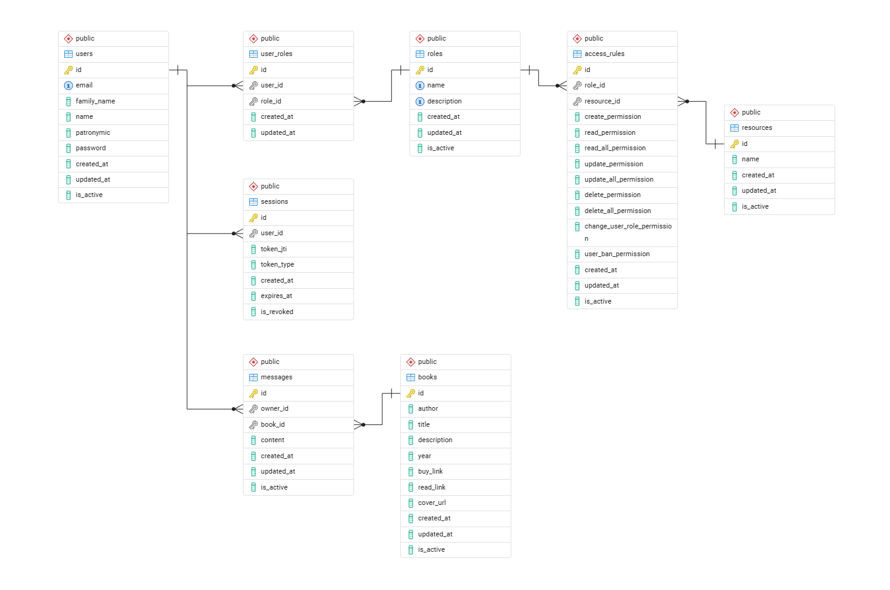

# Auth-form: Система аутентификации и разграничения прав доступа

Реализация backend-приложения с собственной системой аутентификации, авторизации и гибким управлением правами доступа к ресурсам. Проект демонстрирует работу с JWT-токенами, сессиями и RBAC-моделью.

## Техническое задание

Реализовать backend-приложение - собственную систему аутентификации и авторизации, не полагаясь полностью на готовые решения фреймворка.

**1. Взаимодействие с пользователем**  
- Регистрация: ФИО, email, пароль, подтверждение пароля
- Login: вход по email/паролю
- Logout: выход из системы
- Профиль: редактирование личных данных
- Удаление аккаунта: «мягкое» (`is_active=False`), с запретом на вход
- Идентификация: при последующих запросах система должна «узнавать» пользователя

**2. Система разграничения прав доступа**  
- Спроектировать схему БД: роли, ресурсы, правила доступа
- Описать логику в README.md
- Заполнить тестовыми данными для демонстрации
- Возвращать:
  - `401 Unauthorized` - если пользователь не аутентифицирован;  
  - `403 Forbidden` - если пользователь аутентифицирован, но не имеет прав на ресурс.
- API для администратора: CRUD для ролей, ресурсов и правил доступа.

**3. Mock-объекты бизнес-приложения**  
- Не обязательно создавать реальные таблицы, достаточно Mock-View, которые возвращают тестовые данные или ошибки

**Комментарии от авторов ТЗ:**   

Аутентификация:
- bcrypt для хеширования паролей
- jwt для генерации токенов
- Варианты: Bearer-токен в заголовке или сессии + Cookie
- Middleware для присвоения request.user

Авторизация:
- Таблицы: `roles`, `business_elements`, `access_roles_rules`
- Поля прав: `read_permission`, `read_all_permission`, `create_permission`, и т.д.
- `_all` - доступ ко всем объектам, без суффикса - только к своим (`owner_id`)
---

## Реализация

**1. Взаимодействие с пользователем**  


| Требование | Реализация | Файл / Эндпоинт |
|------------|------------|-----------------|
| Регистрация | `POST /register` - валидация через Pydantic, SHA256+bcrypt | `api/deps.py::hash_password` |
| Login | `POST /login` - выдача пары access/refresh JWT | `api/deps.py::generate_token_pair` |
| Logout | Отзыв токена через `jti` в таблице `sessions` | `db/models.py::UserSession` |
| Профиль | `GET/PUT /me` - получение и обновление данных | `api/routers/access_control.py` |
| Удаление | `PATCH /me/deactivate` - `is_active=False` + logout | `db/models.py::ActiveMixin` |
| Идентификация | Middleware + `get_current_user()` подтягивает пользователя по JWT | `api/deps.py`, `api/protect_docs.py` |

---

Пример проверки токена и подгрузки прав доступа:
```python
# api/deps.py
async def get_current_user(token: str = Depends(oauth2_scheme),
                           db: AsyncSession = Depends(get_db)) -> User:

    payload = jwt.decode(token, SECRET_KEY, algorithms=[ALGORITHM])

    # ... загрузка пользователя с roles -> access_rules -> resources
    # через selectinload, чтобы избежать N+1
```

---

**Архитектура с Service Layer**

Бизнес-логика вынесена из роутеров в отдельные сервисные классы - это обеспечивает:
- Single Responsibility - роутеры только обрабатывают HTTP, сервисы - бизнес-правила
- Тестируемость - сервисы можно тестировать изолированно, без HTTP-слоя
- Повторное использование - одна и та же логика вызывается из разных эндпоинтов

**Структура сервисов:**

| Сервис | Ответственность | Файл |
|--------|----------------|------|
| `AccessRuleService` | CRUD правила доступа, валидация дубликатов | `api/services/access_rule_service.py` |
| `AuthService` | Регистрация, логин, логаут, refresh токенов | `api/services/auth_service.py` |
| `UserRoleService` | Управление ролями пользователей, поиск, блокировка | `api/services/user_role_service.py` |
| `UserProfileService` | Управление профилем для пользователей (редактирование / блокировка) | `api/services/user_role_service.py` |
| `MessageService` / `BookService` | Бизнес-логика для mock-объектов | `api/services/*_service.py` |


Пример с `AuthService`:

```python
# api/services/auth_service.py
class AuthService:
    def __init__(self, db: AsyncSession):
        self.db = db  # ← Зависимость внедряется, легко мокать в тестах
    
    async def register_user(self, email: str, ..., password2: str) -> dict:
        # 1. Валидация
        # 2. Проверка дубликатов
        # 3. Хеширование пароля
        # 4. Создание пользователя + роли + сессии токена
        # 5. Возврат токенов
        ...
    
    async def refresh_token(self, refresh_token: str) -> str:
        # 1. Декодирование JWT
        # 2. Проверка типа токена и срока действия
        # 3. Поиск сессии в БД по jti
        # 4. Генерация нового access-токена
        ...
```

**Пример использования в роутере:**
```python
# api/routers/auth.py
@auth_router.post('/register')
async def register_user(..., db: AsyncSession = Depends(get_db)):

    service = AuthService(db)  # Создание сервиса с зависимостью БД
    token = await service.register_user(...)  # Делегирование бизнес-логики в сервис

    return {'access_token': token['access_token'], ...}  # Форматируем полученный ответ
```

**2. Система разграничения прав доступа (RBAC)**   
Система построена на реляционной модели с поддержкой many-to-many связей и гранулярных прав.




- Гранулярные права: `read` vs `read_all`, `update` vs `update_all` - доступ к «своим» или ко «всем» объектам
- Наследование прав: если у пользователя несколько ролей - достаточно права в одной из них
- Защита служебных аккаунтов: `is_staff_account()` не даёт заблокировать `admin`/`moderator`
- Защита от `self-actions`: `check_not_self()` - админ не может удалить/заблокировать себя
- Middleware для `/docs`: документация видна только admin | `api/protect_docs.py`


**Пример проверки прав в эндпоинте:**
```python
# api/routers/access_control.py
@access_control_router.patch('/users/{user_id}/status', summary='Заблокировать/разблокировать пользователя')
async def change_user_status(user_id: int,
                             is_active: bool = Form(...),
                             current_user: User = Depends(check_permission('users', 'user_ban')),
                             db: AsyncSession = Depends(get_db)):

# Если у пользователя нет права 'user_ban' на ресурс 'users' - возбуждение исключения 403_FORBIDDEN
```

При старте загружаются тестовые данные (см. папку mock-data):
```
users: admin@, moderator1@, user1@... (везде одинаковый пароль: '111')
roles: admin, moderator, user, guest
resources: users, messages, books, roles, access_rules
rules: например, `user` может `read` свои `messages`, но не `read_all`
```

Пользователь с ролью `admin` может назначать роли пользователям:
```python
# api/routers/access_control.py
@access_control_router.patch('/users/{user_id}/role', summary='Добавить роль пользователю')
async def add_user_role(user_id: int,
                        role_id: int = Form(...),
                        current_user: User = Depends(check_has_role(roles='admin')),
                        db: AsyncSession = Depends(get_db)):

# Если у пользователь не является 'admin' - возбуждение исключения 403_FORBIDDEN
```


**3. Mock-объекты бизнес-приложения**  

| Ресурс | Описание | Эндпоинт |
|------------|------------|-----------------|
| messages | Отзывы пользователей к книгам | CRUD с проверкой `owner_id` |
| books | Мок-каталог книг | CRUD с проверкой `check_permission('<ресурс>', '<действие>')` |
| users | Управление пользователями | Полный контроль для `admin`, для `moderator` - только бан/разбан |


Пример с проверкой права редактирования отзыва к книге (проверка «свой или есть `_all_permission`»):
```python
# api/deps.py
def check_is_owner_or_has_all_permission(model: SqlModel, 
                                               user: User, 
                                               resource: str, 
                                               action: str) -> User:

    if is_owner(model, user) or has_all_permission(user, resource, action):
        return user
    
    raise HTTPException(status_code=status.HTTP_403_FORBIDDEN,
                        detail=f'Недостаточно прав для действия `{action}` c {resource}')
```


---
### Тестирование (покрытие AuthService)

Для сервиса авторизации реализованы **unit** и **integration** тесты, которые проверяют:

| Тип теста | Что проверяет | Пример |
|-----------|---------------|--------|
| **unit** (`tests/unit/test_auth_service.py`) | Логику сервисных методов на тестовой БД | `test_register_user_success`, `test_login_user_wrong_password` |
| **integration** (`tests/integration/test_auth_endpoints.py`) | Полный HTTP-поток: запрос -> роутер -> сервис -> БД -> ответ | `test_register_endpoint_success`, `test_full_auth_flow` |

### Покрытые сценарии

```
Регистрация:
   - успешная регистрация нового пользователя
   - дубликат email -> 409 Conflict
   - несовпадающие пароли -> 400 Bad Request
   - некорректный email -> 400 Bad Request

Вход (login):
   - успешный вход с выдачей токенов
   - неверный пароль -> 400 Bad Request
   - пользователь не найден -> 400 Bad Request
   - заблокированный пользователь -> 400 Bad Request

Refresh-токен:
   - успешное обновление access-токена
   - просроченный refresh-токен -> 401 Unauthorized
   - передан access-токен вместо refresh -> 400 Bad Request
   - невалидный JWT -> 401 Unauthorized

Logout:
   - успешный отзыв токена (is_revoked=True)
   - невалидный токен -> 400 Bad Request

Полный auth-flow:
   register -> login -> refresh -> logout -> проверка состояния БД
```

### Запуск тестов

```bash
# Запустить только тесты (автоматически поднимет PostgreSQL)
docker-compose --profile test up --build test

# Запустить конкретный тест
docker-compose run --rm test pytest tests/unit/test_auth_service.py::test_login_user_success -v

# Запустить все тесты с подробным выводом
docker-compose run --rm test pytest tests/ -v --tb=short
```

### Инфраструктура тестов

| Компонент | Назначение |
|-----------|------------|
| `tests/conftest.py` | Фикстуры: `test_engine`, `db_session` (с auto-rollback), `test_client` (с подменой `get_db`) |
| `tests/fixtures/` | Мок-данные: `known_users`, `create_auth_form`, `auth_headers` |
| `tests/fixtures/csv_data.py` | Авто-загрузка мок-данных из CSV в тестовую БД (`bookreviews_test`) |
| `pytest.ini` | Настройка asyncio-mode, авто-обнаружение тестов |

### Изоляция тестов

- Каждая тестовая сессия использует `rollback()` - изменения не сохраняются между тестами
- Тестовая БД `bookreviews_test` отделена от основной `bookreviews`
- Мок-данные загружаются один раз на сессию (`scope='session'`, `autouse=True`)


### Что сделано сверх ТЗ:

Фича | Что делает | Где находится
--- | --- | ---
Refresh-токены | Безопасное обновление сессии без повторного логина | `api/deps.py::generate_token_pair`
Фабрика роутеров | DRY: один код для CRUD ролей/ресурсов | `api/utils.py::create_crud_router`
Асинхронность везде | Производительность, non-blocking I/O | `SQLAlchemy 2.0 async, FastAPI`
Валидация email | Ранний отсев некорректных данных | `api/utils.py::validate_email_or_400`
Логирование | Отладка и аудит действий | `logger.debug()` в `api/deps.py`, `api/protect_docs.py`
Health-check | Мониторинг состояния сервиса | `GET /health` в `main.py`
Pre-hash SHA256 + bcrypt | Дополнительный слой защиты паролей | `api/deps.py::hash_password`
Защита `/docs` | Swagger/ReDoc видны только admin | `api/protect_docs.py::AuthDocsMiddleware`
Frontend-заглушка на HTML/JS | для быстрой проверки flow без Postman | `frontend/index.html`


#### Возможности сервиса
- Регистрация, логин, редактирование профиля пользователя, блокировка аккаунта, логаут.
- Подержка входа без логина (на основе jwt-токена)
- CRUD для книг/отзывов (Mock-объекты бизнес-приложения)
- Управление ролями и ресурсами для админа

#### Технологический стек
- Backend: Python 3.13, FastAPI 0.128
- ORM: SQLAlchemy 2.0+ (асинхронный режим)
- База данных: PostgreSQL 17
- Тестирование pytest 9.0, pytest-asyncio, httpx, pytest-mock, Faker
- Контейнеризация: Docker, Docker Compose
- Документация: Swagger UI (OpenAPI)


#### Запуск проекта

1. Клонировать репозиторий:
   ```bash
   git clone https://github.com/Sergei-MIKHAYLOV/auth-form.git
   cd auth-form
   ```

2. Собрать и запустить сервисы:
   ```bash
   docker-compose up --build
   ```

3. Доступные интерфейсы:
   - API Documentation: http://localhost:8000/docs (для админа)
   - pgAdmin (управление БД): http://localhost:5050

#### Настройка pgAdmin

Для подключения к базе данных выполнить следующие действия:
1. Войти в pgAdmin, используя учётные данные:  
   - e-mail: `admin@bookreviews.com`  
   - Пароль: `1111`
2. Нажать Add New Server.
3. Во вкладке General указать имя сервера: `auth-form`.
4. Во вкладке Connection задать параметры подключения:  
     - Host: `postgresDB`  
     - Port: `5432`  
     - Maintenance database: `bookreviews`  
     - Username: `admin`  
     - Password: `1111`
5. Нажать Save.